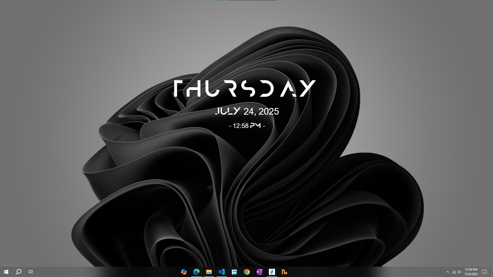
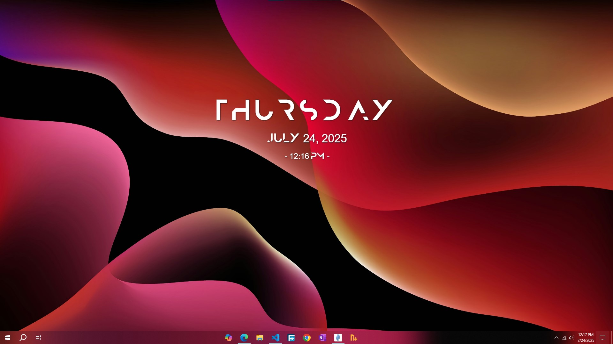

# ⏰ Desktop Clock Widget

  

A minimalist, transparent, and undraggable clock widget for your Windows desktop, built with Electron. Designed to blend seamlessly with your wallpaper, just like a Rainmeter skin, without interfering with your workflow.

---

## ✨ Features

- 🖥️ **Seamless Desktop Integration:** Appears directly on your desktop wallpaper, not as an overlay on top of other windows.
- 🪟 **Transparent & Frameless:** No visible window borders or backgrounds, just your clock content.
- 🖱️ **Undraggable & Non-Interactive:** Clicks pass through the widget, allowing you to interact with desktop icons and windows behind it without interference.
- 🖋️ **Customizable Font:** Easily change the font to match your desktop aesthetic.
- 📍 **Fixed Position:** Configured to appear at a specific, non-intrusive position (20% from the top, horizontally centered).
- 🧊 **Resource Friendly:** Optimized to have minimal impact on your PC's resources.

---

## 📸 Screenshots



---



---

## 🚀 Installation & Download

### 📥 Download from Releases (Recommended)

The easiest way to install the app is to download the pre-built installer from the GitHub Releases page.

1. Go to the [Releases](https://github.com/nicocodes9/desktop-clock-widget/releases) page of this repository.
2. Find the latest release (e.g., `v1.0.0`).
3. Under the "Assets" section, download the `Desktop Clock Setup.exe` file.
4. Run the downloaded `.exe` installer and follow the on-screen instructions.
5. Once installed, you can launch the "Desktop Clock" application from your Start Menu.

> 💡 **Tip:** The app will automatically launch at startup. No need to manually add it to your Windows Startup folder!

---

### 🛠️ Build from Source

If you're a developer or prefer to build the application yourself, follow these steps:

#### **Prerequisites**

- [Node.js](https://nodejs.org/) (LTS version recommended)
- npm (comes with Node.js)

#### **Steps**

1. **Clone the Repository:**

   ```sh
   git clone https://github.com/nicocodes9/desktop-clock-widget.git
   cd electron-clock-widget
   ```

2. **Install Dependencies:**

   ```sh
   npm install
   ```

3. **Build the Application:**

   ```sh
   npm run build
   ```

   This command will create a distributable `.exe` installer for Windows (64-bit) in the `dist` folder.

4. **Run the Installer:**
   Navigate to the newly created `dist` folder and run the `Desktop Clock Setup.exe` file to install the application.

---

## 💡 Usage

- Launch the "Desktop Clock" application from your Start Menu or desktop shortcut.
- The clock widget will appear on your desktop, centered horizontally and positioned 20% from the top of your screen.
- It will automatically update every minute.
- Clicks will pass through the widget to your desktop icons.
- To quit the clock, right-click the tray icon and select **Quit Clock**.

---

## 🎨 Customization

You can easily customize the clock's appearance and position by editing the source code:

### **Font**

- Place your desired `.otf` or `.ttf` font file in the root directory of the project (next to `index.html`).
- Open `index.html` and update the `src` URL in the `@font-face` rule:
  ```css
  @font-face {
    font-family: "CustomFont"; /* You can change this name too */
    src: url("YourNewFont.otf") format("opentype"); /* Update this path/filename */
  }
  ```
- Update the `font-family` in the `body` style if you changed `CustomFont`.

### **Size & Color**

- Edit the `font-size` and `color` properties within the `<style>` tags in `index.html` for `.day`, `.date`, and `.time` classes.

### **Position**

- Open `main.js`.
- Adjust `width` and `height` in `BrowserWindow` options for the overall widget size.
- Modify `yPosition` calculation (`height * 0.20`) to change the vertical position.
- Adjust `x` calculation (`(width - 400) / 2`) if you change the width of the `BrowserWindow` and want to keep it centered.

> After making changes, you'll need to rebuild the application (`npm run build`) and reinstall it to see the updates.

---

## 🤝 Contributing

Contributions are welcome! If you have ideas for improvements, new features, or bug fixes, please feel free to:

1. Fork this repository.
2. Create a new branch:
   ```sh
   git checkout -b feature/your-feature
   ```
3. Make your changes.
4. Commit your changes:
   ```sh
   git commit -m 'Add new feature'
   ```
5. Push to the branch:
   ```sh
   git push origin feature/your-feature
   ```
6. Open a Pull Request.

---

## 📄 License

This project is licensed under the MIT License - see the [LICENSE](LICENSE) file for details.

---

## 🙏 Acknowledgements

- [Electron](https://www.electronjs.org/) - For making desktop apps with web technologies a breeze.
- [electron-builder](https://www.electron.build/) - For simplifying the packaging and distribution process.
